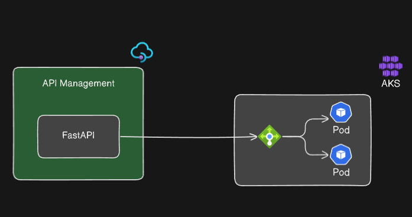

# Application Infrastructure Documentation

This documentation explains the infrastructure defined in **Bicep** templates and how the components (AKS, ACR, API Management) are interconnected. The **FastAPI** application is deployed in an **Azure Kubernetes Service (AKS)** cluster with an **API Management** layer in front, and all resources are provisioned and managed using modular Bicep files. Here's a breakdown of the repository structure, the key components, and how they work together.

---

## Repository Structure and Modules

### Directory Structure:
- **`environments/prod`**: 
  - **`main.bicep`**: The main orchestration file that connects all the infrastructure modules for the production environment.
  - **`parameters.json`**: Contains environment-specific values such as resource names and locations.
  
- **`modules/acr/acr.bicep`**: Manages the Azure Container Registry (ACR), used for storing Docker images for the FastAPI application.
  
- **`modules/aks/aks.bicep`**: Defines the AKS cluster and node pools where the FastAPI application will be deployed.
  
- **`modules/apim/apim.bicep`**: Deploys Azure API Management, which controls access to the FastAPI application in AKS.

---

## Key Components

### 1. Azure Container Registry (ACR)

**Definition**:  
- Managed by `acr.bicep`, ACR is where the **Docker images** for the FastAPI application are stored and pulled from by AKS during deployments.

**Connectivity**:
- The CI/CD pipeline builds the Docker image and pushes it to ACR.
- AKS pulls the image from ACR during deployments.

**Modules**:
- `acr.bicep` handles the creation and configuration of the ACR instance, along with scope maps that define permissions for different roles like push, pull, and admin actions.

---

### 2. Azure Kubernetes Service (AKS)

**Definition**:  
- Managed by `aks.bicep`, AKS is where the FastAPI application is hosted. AKS is configured to auto-scale based on resource demands, ensuring high availability and efficient resource use.
- **Key properties**:
  - **Node pool**: A virtual machine scale set (VMSS) is used to run the containers, with auto-scaling enabled to manage between 2 and 3 nodes.

**Connectivity**:
- AKS pulls the Docker image from ACR and runs it inside a Kubernetes pod.
- **API Management**: Acts as a gateway for external requests, routing traffic to the FastAPI service in AKS.

**Modules**:
- `aks.bicep` handles the provisioning of the AKS cluster, including node pool configurations, auto-scaling, and networking settings.

---

### 3. Azure API Management (APIM)

**Definition**:  
- Managed by `apim.bicep`, APIM serves as the **front-end** for all external traffic. It enforces authentication using API keys or JWT tokens before forwarding requests to the AKS cluster, ensuring security.
- **Key properties**:
  - **Public Network Access**: Enabled to allow traffic from external sources.
  - **API Gateway**: Handles routing and authentication for all incoming requests, validating API keys or JWT tokens before forwarding them to AKS.

**Connectivity**:
- All incoming requests are routed through APIM, which forwards them to the FastAPI pods running in AKS.

**Modules**:
- `apim.bicep` defines the API Management service, including configuration for public access, authentication, and routing policies.

---

## Deployment Flow and Infrastructure Orchestration

The infrastructure is deployed in a modular way, allowing easy updates and reusability across different environments (like dev, staging, and production).

### 1. ACR Deployment:
   - The ACR is created and configured using the `acr.bicep` module. This is the first component deployed, as it is needed for storing Docker images that the AKS cluster will pull.

### 2. AKS Deployment:
   - The AKS cluster is deployed next using the `aks.bicep` module. It includes a node pool configured for auto-scaling, and the network profile is set up to allow communication with API Management.
   - The cluster is set up with Role-Based Access Control (RBAC), ensuring secure management of the Kubernetes resources.

### 3. API Management Deployment:
   - Finally, the API Management service is deployed using the `apim.bicep` module. It is configured to manage the incoming traffic.

### Main Orchestration File (main.bicep):
- The `main.bicep` file brings everything together by deploying ACR, AKS, and APIM in the correct order. It pulls in the modules and parameters from the `parameters.json` file, ensuring that all components are deployed consistently and connected properly.
